# Exercises 1

<br>

## A priori

### Conectar Remotamente (SSH)

#### Q&A:

* https://askubuntu.com/questions/46930/how-can-i-set-up-password-less-ssh-login

* https://askubuntu.com/questions/4830/easiest-way-to-copy-ssh-keys-to-another-machine/4833#4833

#### Terminal Guest:

```shell
ifconfig
```

#### Terminal Host:

```shell
ping 192.168.126.129
```

```shell
ssh-keygen
	^Enter
	^Enter
	^Enter
```

```shell
ssh-copy-id root@192.168.126.129
	yes
	password
```

```shell
ssh root@192.168.126.129
```

<br>

<br>

## Email security using PGP (GnuPG)

### 1. Create a public and private key pair using GnuPG

```shell
gpg --gen-key
```

```shell
cd .gnupg/
```

```shell
gpg --list-keys
```

```shell
gpg -k
```

<br>

### 2. Publish you PGP public key on http://pgp.dei.uc.pt

```shell
gpg --export -a dario@student.dei.uc.pt
```

<br>

### 3. Add the public keys of other users to your PGP Keyring

```shell
gpg --import publicGranjal.key
```

<br>

### 4. Validate the public keys of other users on your PGP Keyring


```shell
gpg --edit-key mddias@student.dei.uc.pt
```

Validar chave publica:

```shell
sign
```

<br>

### 5. Change the level of trust on another user on your Keyring

Mudar de nivel de confiança:

```shell
trust
```

```shell
quit
```

<br>

### 6.  Use PGP to secure email

#### Send an encrypted message:

```shell
gpg -sea
```

#### Decrypt a received message:

```shell

```

#### Send a signed message:

```shell

```

#### Verify the signature in a received message:

```shell

```

#### Send a signed and encrypted message:

```shell

```

#### Verify and decrypt a received message:

```shell

```

<br>

<br>

## Configuring PGP on your email client

### Q&A:

* https://snapcraft.io/install/thunderbird/centos

* https://helpdesk.dei.uc.pt/configuration-instructions/email-configuration/#thunderbird

<br>

### Tutorial:

#### Privilegios Root:

```shell
su - root
```

<br>

#### Update & Upgrade:

```shell
yum update && yum upgrade
```

<br>

#### Remover atual Thunderbird (instalado pelo `yum`):

```shell
yum remove thunderbird
```

<br>

#### Enable snaps on CentOS and install Thunderbird:

```shell
yum install epel-release
```

```shell
yum install snapd
```

```shell
systemctl enable --now snapd.socket
```

```shell
ln -s /var/lib/snapd/snap /snap
```

`⚠️ Restart your system, to ensure snap’s paths are updated correctly.`

```shell
snap install thunderbird
```

<br>

#### Open Thunderbird:

##### Configurar:

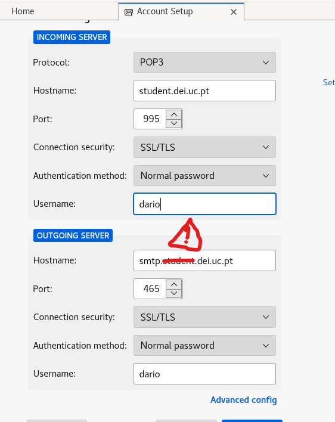

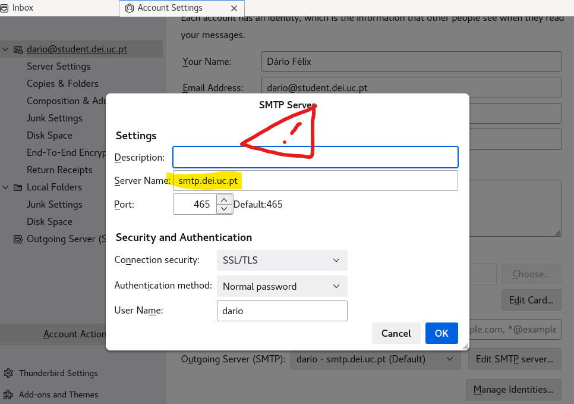

<br>

##### Import OpenPGP Key File:


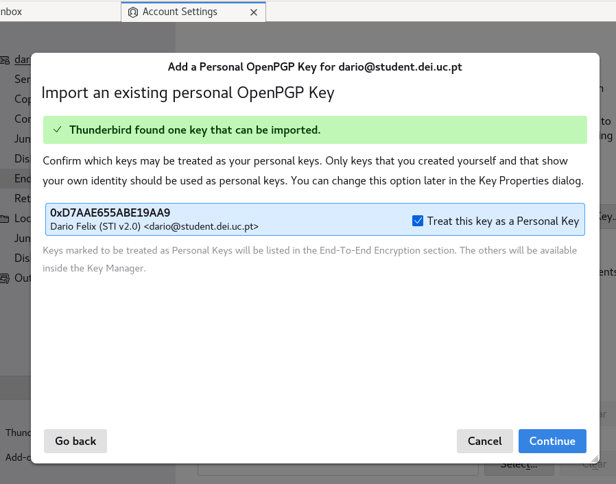

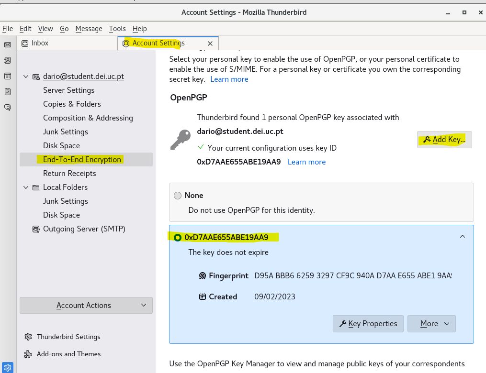

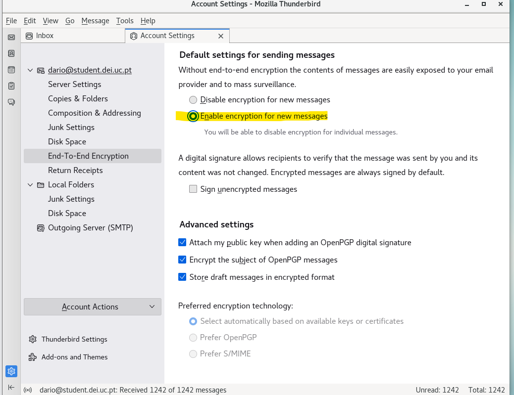

<br>

##### Add Public Keys:

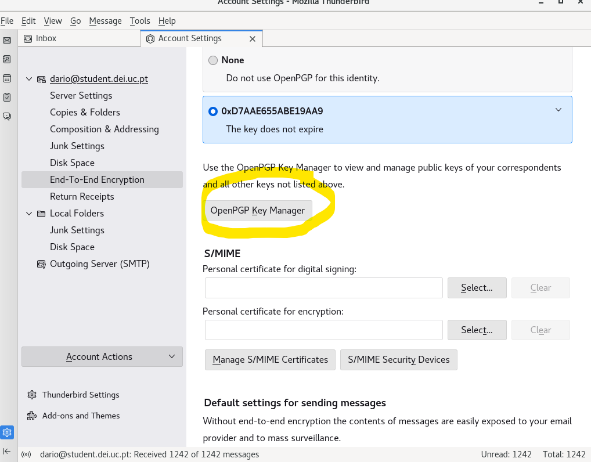

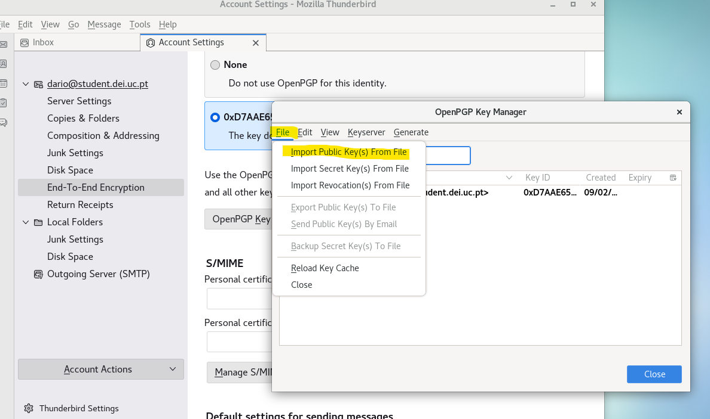

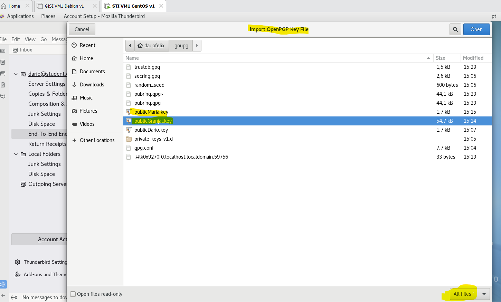

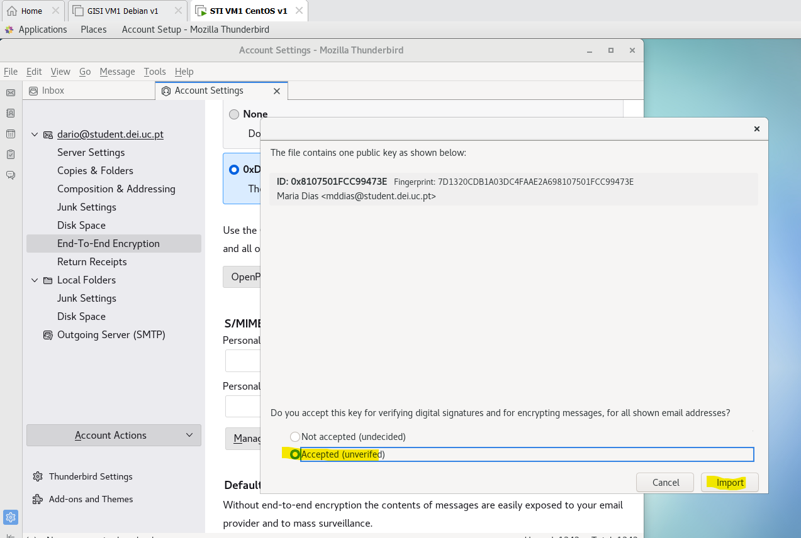

<br>

##### Send Mail:

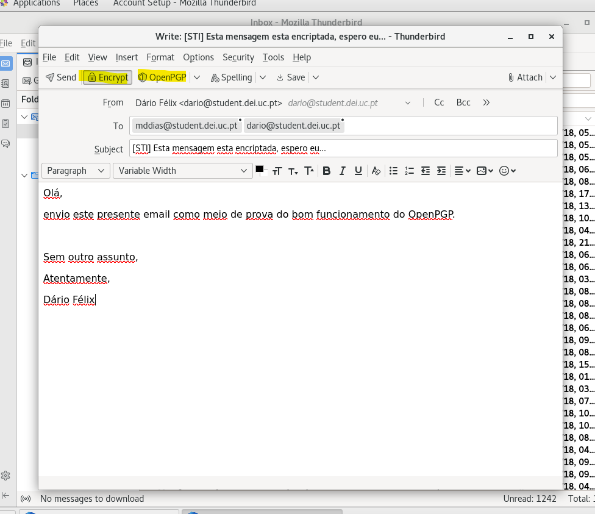

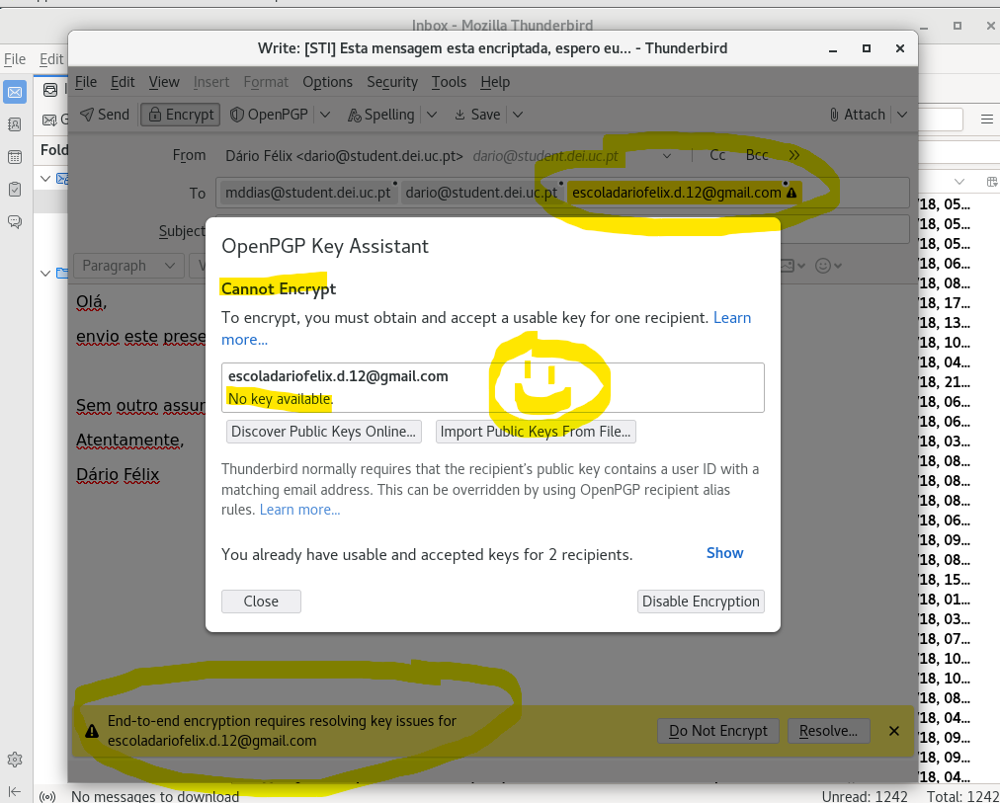

<br>

##### Test Read Mail:

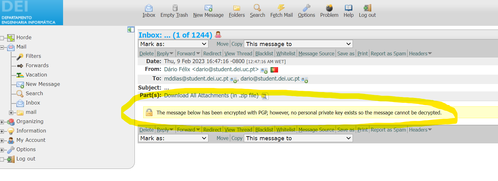

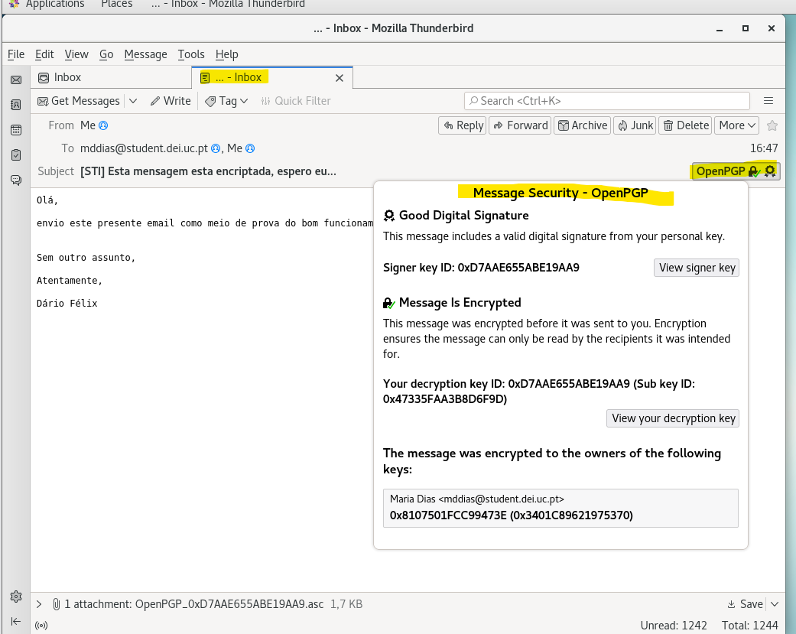

